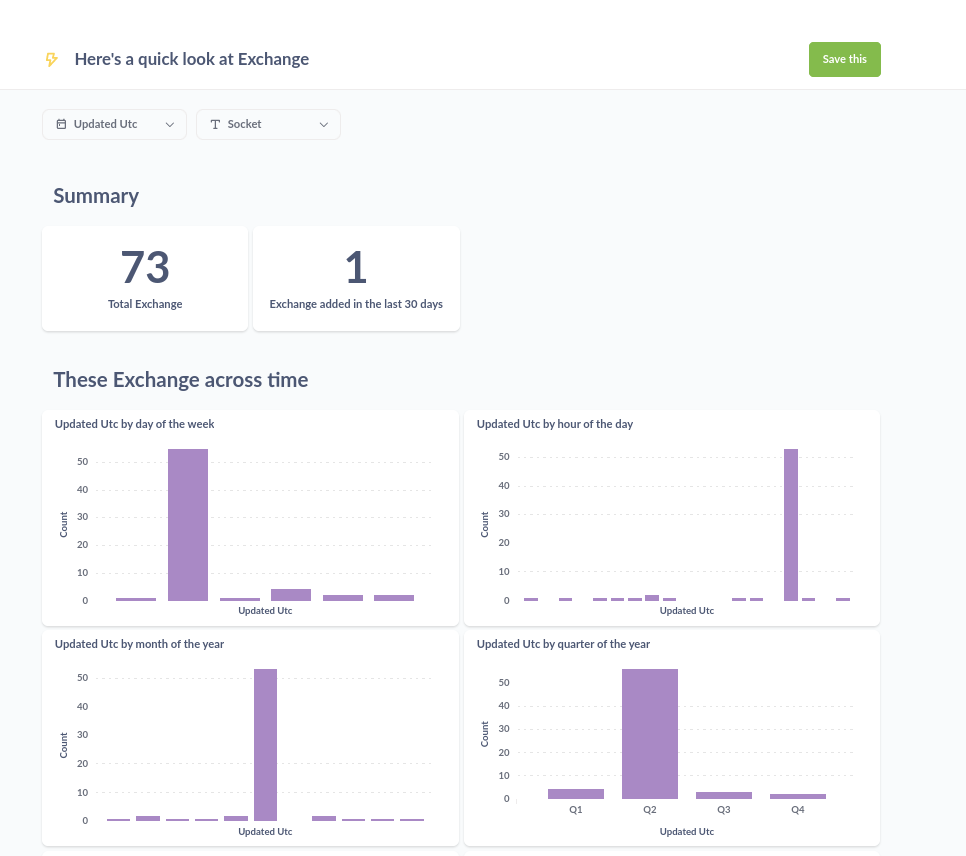

# BitCoinGlance: Real-time Cryptocurrency Exchange Data Pipeline

## Project Overview

BitCoinGlance is a robust, scalable data engineering solution designed to capture, process, and analyze real-time cryptocurrency exchange data. This project demonstrates proficiency in building end-to-end ETL pipelines, data warehousing, and creating actionable insights for financial analysis.

## Key Features

1. **Real-time Data Ingestion**: Automated ETL process pulling live data from the CoinCap API every 5 minutes.
2. **Scalable Data Warehouse**: Utilizes PostgreSQL for efficient storage and querying of large-scale financial data.
3. **Containerized Architecture**: Docker-based setup ensuring consistency across development, testing, and production environments.
4. **Automated Testing**: Comprehensive unit and integration tests to maintain data integrity and pipeline reliability.
5. **Infrastructure as Code**: Terraform scripts for easy deployment and management of AWS infrastructure.
6. **Data Visualization**: Integrated Metabase dashboard for real-time market insights and trend analysis.

## Technology Stack

- **ETL Pipeline**: Python, requests library
- **Data Warehouse**: PostgreSQL
- **Containerization**: Docker, Docker Compose
- **Scheduling**: Cron
- **Cloud Infrastructure**: AWS EC2, Terraform
- **Testing**: pytest
- **Code Quality**: Black, Flake8, MyPy, isort
- **Data Visualization**: Metabase

## Business Value

1. **Market Intelligence**: Provides up-to-the-minute insights on cryptocurrency exchange performance, enabling informed trading decisions and strategy formulation.
2. **Risk Management**: Allows financial institutions to monitor market volatility and adjust their cryptocurrency portfolios in real-time.
3. **Competitive Analysis**: Offers a comprehensive view of trading volumes and market share across different exchanges, facilitating competitive benchmarking.
4. **Operational Efficiency**: Automates data collection and processing, reducing manual effort and minimizing human error in financial data analysis.
5. **Scalability**: Designed to handle increasing data volumes as the cryptocurrency market expands, ensuring long-term viability.

## Data Engineering Highlights

1. **Efficient ETL Design**: Optimized Python scripts for extracting and transforming large volumes of financial data with minimal latency.
2. **Data Quality Assurance**: Implemented robust error handling and data validation to ensure the accuracy and reliability of financial metrics.
3. **Performance Tuning**: Optimized PostgreSQL queries and table structures for fast data retrieval, essential for real-time financial analysis.
4. **Scalable Architecture**: Designed a modular, containerized system that can easily scale to accommodate additional data sources or increased data volumes.
5. **DevOps Integration**: Incorporated CI/CD practices with automated testing and infrastructure-as-code, demonstrating a modern approach to data engineering.

## Running the Pipeline
To run locally, you need:

1. [git](https://git-scm.com/book/en/v2/Getting-Started-Installing-Git)
2. [Github account](https://github.com/)
3. [Docker](https://docs.docker.com/engine/install/) with at least 4GB of RAM and [Docker Compose](https://docs.docker.com/compose/install/) v1.27.0 or later

Clone the repo and run the following commands to start the data pipeline:

```bash
git clone https://github.com/josephmachado/bitcoinMonitor.git
cd bitcoinMonitor
make up
sleep 30 # wait for Metabase to start
make ci # run checks and tests
```
Go to [http:localhost:3000](http:localhost:3000) to see the Metabase UI(username and password is sdeuser and sdepassword1234 respectively).

The metabase UI will look like the following



## Architecture


We use python to pull, transform and load data. Our warehouse is postgres. We also spin up a Metabase instance for our presentation layer.

All of the components are running as docker containers.# BitCoinGlance: Real-time Cryptocurrency Exchange Data Pipeline

## Project Overview

BitCoinGlance is a robust, scalable data engineering solution designed to capture, process, and analyze real-time cryptocurrency exchange data. This project demonstrates proficiency in building end-to-end ETL pipelines, data warehousing, and creating actionable insights for financial analysis.

## Key Features

1. **Real-time Data Ingestion**: Automated ETL process pulling live data from the CoinCap API every 5 minutes.
2. **Scalable Data Warehouse**: Utilizes PostgreSQL for efficient storage and querying of large-scale financial data.
3. **Containerized Architecture**: Docker-based setup ensuring consistency across development, testing, and production environments.
4. **Automated Testing**: Comprehensive unit and integration tests to maintain data integrity and pipeline reliability.
5. **Infrastructure as Code**: Terraform scripts for easy deployment and management of AWS infrastructure.
6. **Data Visualization**: Integrated Metabase dashboard for real-time market insights and trend analysis.

## Technology Stack

- **ETL Pipeline**: Python, requests library
- **Data Warehouse**: PostgreSQL
- **Containerization**: Docker, Docker Compose
- **Scheduling**: Cron
- **Cloud Infrastructure**: AWS EC2, Terraform
- **Testing**: pytest
- **Code Quality**: Black, Flake8, MyPy, isort
- **Data Visualization**: Metabase

## Business Value

1. **Market Intelligence**: Provides up-to-the-minute insights on cryptocurrency exchange performance, enabling informed trading decisions and strategy formulation.
2. **Risk Management**: Allows financial institutions to monitor market volatility and adjust their cryptocurrency portfolios in real-time.
3. **Competitive Analysis**: Offers a comprehensive view of trading volumes and market share across different exchanges, facilitating competitive benchmarking.
4. **Operational Efficiency**: Automates data collection and processing, reducing manual effort and minimizing human error in financial data analysis.
5. **Scalability**: Designed to handle increasing data volumes as the cryptocurrency market expands, ensuring long-term viability.

## Data Engineering Highlights

1. **Efficient ETL Design**: Optimized Python scripts for extracting and transforming large volumes of financial data with minimal latency.
2. **Data Quality Assurance**: Implemented robust error handling and data validation to ensure the accuracy and reliability of financial metrics.
3. **Performance Tuning**: Optimized PostgreSQL queries and table structures for fast data retrieval, essential for real-time financial analysis.
4. **Scalable Architecture**: Designed a modular, containerized system that can easily scale to accommodate additional data sources or increased data volumes.
5. **DevOps Integration**: Incorporated CI/CD practices with automated testing and infrastructure-as-code, demonstrating a modern approach to data engineering.

## Running the Pipeline
To run locally, you need:

1. [git](https://git-scm.com/book/en/v2/Getting-Started-Installing-Git)
2. [Github account](https://github.com/)
3. [Docker](https://docs.docker.com/engine/install/) with at least 4GB of RAM and [Docker Compose](https://docs.docker.com/compose/install/) v1.27.0 or later

Clone the repo and run the following commands to start the data pipeline:

```bash
git clone https://github.com/josephmachado/bitcoinMonitor.git
cd bitcoinMonitor
make up
sleep 30 # wait for Metabase to start
make ci # run checks and tests
```
Go to [http:localhost:3000](http:localhost:3000) to see the Metabase UI(username and password is sdeuser and sdepassword1234 respectively).

The metabase UI will look like the following


## Architecture


We use python to pull, transform and load data. Our warehouse is postgres. We also spin up a Metabase instance for our presentation layer.

All of the components are running as docker containers.
